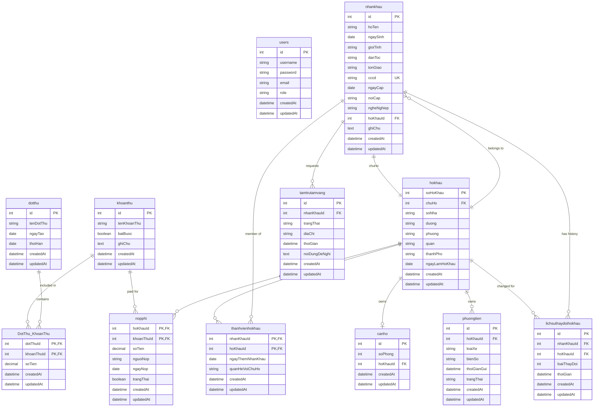

# IT4082 - Apartment Management System Database

## Overview

This is the database schema for the IT4082 apartment management system project. The system manages households, residents, apartments, fees, payments, and vehicles in an apartment complex.

## Database Schema

### Entity Relationship Diagram



## Database Tables

### Core Tables

#### 1. `users`
- **Purpose**: System user authentication and authorization
- **Primary Key**: `id`
- **Fields**: username, password, email, role

#### 2. `nhankhau` (Residents)
- **Purpose**: Individual resident information
- **Primary Key**: `id`
- **Foreign Keys**: 
  - `hoKhauId` → `hokhau.soHoKhau`
- **Key Fields**: hoTen, ngaySinh, gioiTinh, cccd

#### 3. `hokhau` (Households)
- **Purpose**: Household registration information
- **Primary Key**: `soHoKhau`
- **Foreign Keys**: 
  - `chuHo` → `nhankhau.id`
- **Key Fields**: chuHo, address information, ngayLamHoKhau

#### 4. `canho` (Apartments)
- **Purpose**: Apartment/room information
- **Primary Key**: `id`
- **Foreign Keys**: 
  - `hoKhauId` → `hokhau.soHoKhau`
- **Key Fields**: soPhong, hoKhauId

#### 5. `phuongtien` (Vehicles)
- **Purpose**: Vehicle registration and parking management
- **Primary Key**: `id`
- **Foreign Keys**: 
  - `hoKhauId` → `hokhau.soHoKhau`
- **Key Fields**: loaiXe, bienSo, trangThai

### Fee Management Tables

#### 6. `khoanthu` (Fee Types)
- **Purpose**: Define different types of fees
- **Primary Key**: `id`
- **Key Fields**: tenKhoanThu, batBuoc, ghiChu

#### 7. `dotthu` (Collection Periods)
- **Purpose**: Define fee collection periods
- **Primary Key**: `id`
- **Key Fields**: tenDotThu, ngayTao, thoiHan

#### 8. `DotThu_KhoanThu` (Collection-Fee Junction)
- **Purpose**: Many-to-many relationship between collection periods and fee types
- **Primary Key**: Composite (`dotThuId`, `khoanThuId`)
- **Foreign Keys**: 
  - `dotThuId` → `dotthu.id`
  - `khoanThuId` → `khoanthu.id`

#### 9. `nopphi` (Payments)
- **Purpose**: Record fee payments by households
- **Primary Key**: Composite (`hoKhauId`, `khoanThuId`)
- **Foreign Keys**: 
  - `hoKhauId` → `hokhau.soHoKhau`
  - `khoanThuId` → `khoanthu.id`

### Membership and History Tables

#### 10. `thanhvienhokhau` (Household Members)
- **Purpose**: Define household membership relationships
- **Primary Key**: Composite (`nhanKhauId`, `hoKhauId`)
- **Foreign Keys**: 
  - `nhanKhauId` → `nhankhau.id`
  - `hoKhauId` → `hokhau.soHoKhau`

#### 11. `lichsuthaydoihokhau` (Household Change History)
- **Purpose**: Track changes in household composition
- **Primary Key**: `id`
- **Foreign Keys**: 
  - `nhanKhauId` → `nhankhau.id`
  - `hoKhauId` → `hokhau.soHoKhau`

#### 12. `tamtrutamvang` (Temporary Residence)
- **Purpose**: Manage temporary residence requests
- **Primary Key**: `id`
- **Foreign Keys**: 
  - `nhanKhauId` → `nhankhau.id`

## Key Relationships

### 1. Household-Resident Relationship
- **Circular Dependency**: `hokhau.chuHo` → `nhankhau.id` AND `nhankhau.hoKhauId` → `hokhau.soHoKhau`
- **Resolution**: The head of household (`chuHo`) must be a resident, and residents belong to households

### 2. Fee Management Flow
1. Define fee types in `khoanthu`
2. Create collection periods in `dotthu`
3. Associate fees with periods via `DotThu_KhoanThu`
4. Record payments in `nopphi`

### 3. Membership Tracking
- `thanhvienhokhau`: Current household composition
- `lichsuthaydoihokhau`: Historical changes
- `tamtrutamvang`: Temporary residence requests

## Database Constraints

### Foreign Key Constraints
- All foreign key relationships are enforced at database level
- Cascading deletes are configured where appropriate
- Referential integrity is maintained

### Unique Constraints
- `nhankhau.cccd`: Unique citizen ID
- `canho.hoKhauId`: One apartment per household
- `hokhau.chuHo`: One head per household

### Data Types
- **IDs**: INTEGER with auto-increment
- **Names/Text**: VARCHAR/STRING
- **Dates**: DATE for date-only, DATETIME for timestamps
- **Money**: DECIMAL(15,2) for precise financial calculations
- **Flags**: BOOLEAN for true/false values

## Migration History

The database was created through the following migrations:
1. `20250608000001-reset-database-schema.js` - Initial schema creation
2. `20250608000003-add-missing-fields.js` - Added hoKhauId to nhankhau
3. `20250608000006-rename-canho-chuHoId-to-hoKhauId.js` - Field name standardization
4. `20250608000007-add-final-foreign-keys.js` - Complete foreign key setup

## Sample Data

The database includes sample data for testing:
- 3 users (admin, staff, user roles)
- 4 residents with complete information
- 1 household with proper relationships
- 3 apartments, 3 vehicles
- 4 fee types, 2 collection periods, 3 payment records

## Development Notes

### Model Validation
- All Sequelize models have been updated to match the current schema
- Associations are properly configured with `sourceKey`/`targetKey` specifications
- Junction table models are created for many-to-many relationships

### Best Practices
- Use transactions for operations affecting multiple tables
- Validate foreign key relationships before insertions
- Handle the circular dependency between `hokhau` and `nhankhau` carefully
- Use appropriate indexes on frequently queried fields

## Usage

To set up the database:

1. **Configure environment**:
   ```bash
   # Update .env file with database credentials
   DB_HOST=localhost
   DB_USERNAME=your_username
   DB_PASSWORD=your_password
   DB_NAME=department_management
   ```

2. **Run migrations**:
   ```bash
   npm run migrate
   ```

3. **Seed sample data**:
   ```bash
   npm run seed
   ```

4. **Test associations**:
   ```bash
   node -e "const { sequelize } = require('./db/models'); sequelize.authenticate().then(() => console.log('✅ Connected')).catch(console.error);"
   ```

## API Endpoints

The system provides RESTful APIs for:
- Resident management (`/api/residents`)
- Household management (`/api/households`)
- Fee management (`/api/fees`)
- Payment processing (`/api/payments`)
- Statistics and reports (`/api/statistics`)

For detailed API documentation, see the `/docs` folder.
